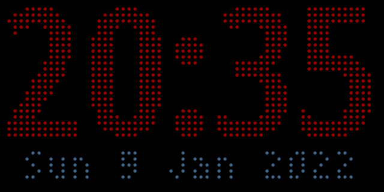
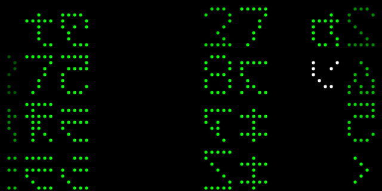
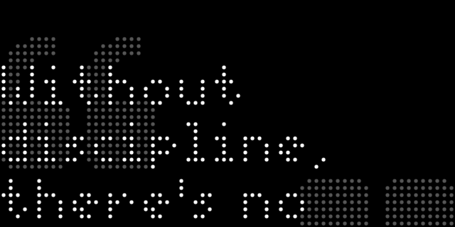
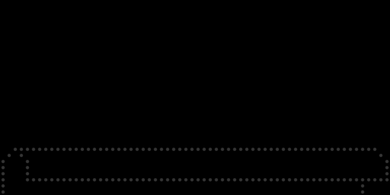
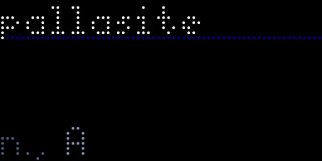

# Apps by Henry for Tidbyt

All the apps here are licensed under the MIT license

## date_and_time.star - Big-Number Clock With Date

The official clock app is too small for my liking, so I created this one with
larger numbers.  It also shows the current date below.  Colors are configurable
via parameters.  See the file for more details.

## digital_rain.star - Digital Rain à la The Matrix

What modern device doesn't have some implementation of the "digital rain" from
*The Matrix*.  My version employs symbols similar to the ones from the movie,
redrawn to a lower resolution.  Some symbols (like the period, double quotes,
and underscore) are omitted because they cause odd-looking gaps when not fully
visible.  The algorithm is based on a pseudo-random number generator and will
generate a new sequence every thirty minutes.

## they_said_so.star - Quote Of the Day powered by theysaidso.com

Shows the quote of the day according to [theysaidso.com](https://theysaido.com).
Different categories are available and may be selected by parameter.  See the
file for more details.  Requires Pixlet 0.6.0.

## they_said_so_bible.star - Bible Verse Of the Day powered by theysaidso.com

Shows the Bible verse of the day according to [theysaidso.com](https://theysaido.com).
Requires Pixlet 0.6.0.

## wordnik.star - Word Of the Day powered by Wordnik

Shows the word of the day according to [Wordnik](https://www.wordnik.com/word-of-the-day).
Requires Pixlet 0.6.0.
